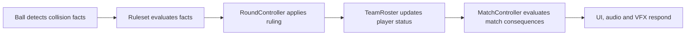

# Future Architecture

## Status and boundary

This is a target architecture for multi-participant development. It is not
implemented and does not authorize a rewrite. [ARCHITECTURE.md](ARCHITECTURE.md)
remains authoritative for current code.

## Intended component model

| Component | Future responsibility |
| --- | --- |
| `PlayerAvatar` | Physical movement, collision body, hitboxes, catch volume, held-ball anchors, throw and defence systems, animation hooks |
| `HumanController` | Convert local input into player intent |
| `BotController` | Convert AI decisions into the same player-intent interface |
| `MatchController` | Match configuration, rosters, scores, overall lifecycle, victory and completion |
| `RoundController` | Countdown, activation, rule-evaluation coordination, elimination, revival, round victory, intermission and reset |
| `DodgeballRuleset` | Data-driven evaluation of collision facts and mode/configuration rules |
| `TeamRoster` / `TeamManager` | Membership, active/eliminated/prisoner lists, revival queue, spawn assignment and disconnection substitution |
| `Ball` | Physics, possession, live/dead and activation state, attribution, collision and flight history |
| `MapContract` | Spawns, lines, boundaries, zones and navigation data |

Future ruleset implementations include `StandardDodgeballRules`,
`PrisonBallRules` and `CustomRules`. Humans and bots should control the same
avatar through the same intent interface so movement and mechanic constraints
do not diverge.

## Ownership boundaries

- `MatchController` owns match-scale truth, not ball collision details.
- `RoundController` is the sole applier of round rulings and player-state
  transitions.
- A ruleset evaluates facts but does not move physics bodies or render UI.
- `TeamRoster` owns membership and status collections; team survival is derived
  from player states.
- A `Ball` owns physical and flight facts but does not decide elimination.
- A map supplies geometry and semantic locations, never match rules.
- Controllers request intents; the avatar validates and executes available
  mechanics.
- UI, audio and VFX observe authoritative state/events and never own gameplay.

## Preferred future hit processing

This replaces the prototype shortcut in which the ball emits a typed
participant-hit signal and `Main` immediately eliminates that participant.

## Map contract

Every future map exposes team spawn locations, ball spawn locations, centre
line, activation lines, playable boundaries, prison zones, spectator zones and
navigation data. Maps must not hard-code match rules. Contract validation
should reject a map that lacks data required by the selected mode.

## UI modules

Separate modules are intended for the personal HUD, round HUD, scoreboard,
pause/settings menu, lobby/configuration menu and results screen. They consume
read-only projections and descriptive events rather than mutating round state.

## Signals and events

Use direct typed Godot signals for nearby communication where sender and
receiver have a clear relationship. A lightweight central event system is
reserved for broad descriptive events such as:

- `round_started`, `round_completed`;
- `player_eliminated`, `player_revived`;
- `score_changed`, `match_completed`;
- `ball_thrown`, `ball_caught`, `player_hit`.

Audio and VFX may subscribe to these events, but their timing or completion
must never determine an authoritative ruling.

## Networking boundary — Long-term possibility

Future servers must be authoritative for ball physics, possession, catches,
blocks, hits, eliminations, player-position validation, round results, scoring
and match outcomes. Networking modules handle command transport, snapshots,
authoritative replication, corrections and replicated events.

Clients may predict local and camera movement, dodge movement, throw animations
and immediate non-authoritative presentation. The server reconciles prediction
and alone decides authoritative outcomes.

Disconnection policy is configurable. Casual servers may replace a disconnected
player with a bot, or remove the player when bots are disabled. Competitive
servers may allow an approximately 30–60 second configurable reconnection
period, then remove, replace or forfeit according to policy.

## Migration from the implemented prototype

Do not immediately rewrite the prototype. Current `Main` remains the narrow
coordinator and should first pass M8. When multi-participant work is separately
approved, extraction should be gradual:

1. Preserve behaviour with regression tests.
2. Introduce a shared player-intent boundary and migrate human/bot control
   incrementally toward `PlayerAvatar`.
3. Extract round policy from `Main` into `RoundController`.
4. Add `DodgeballRuleset` evaluation around existing facts.
5. Add `TeamRoster` and spawn ownership only when multiple participants demand
   them.
6. Separate `MatchController`, `SpawnManager` and `UIController` as match
   formats and configuration arrive.

This sequence is illustrative and conditional. The first post-M8 implementation
milestone has not been selected; avoid premature framework construction.
