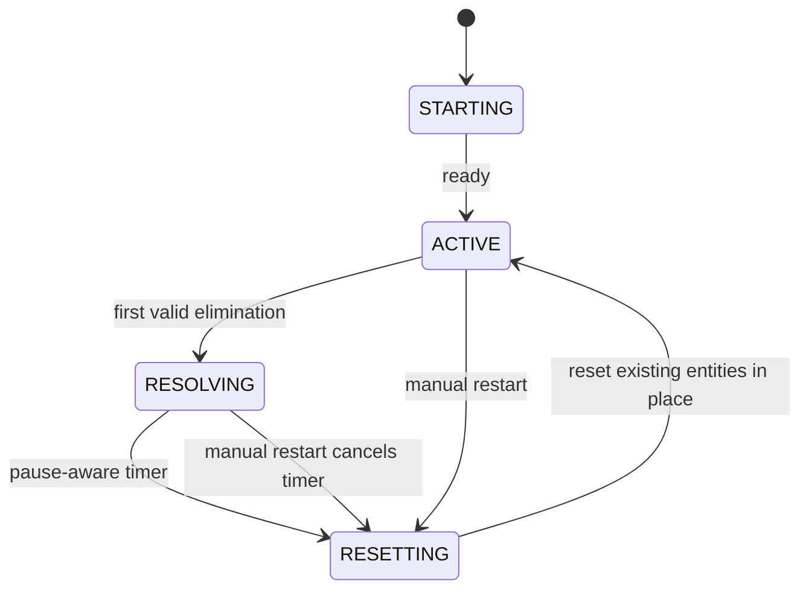
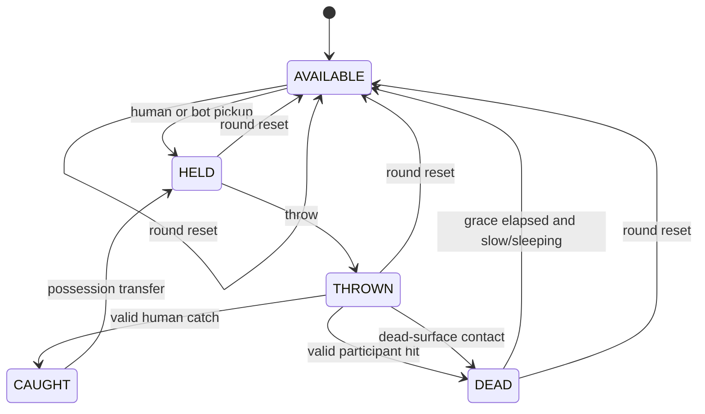
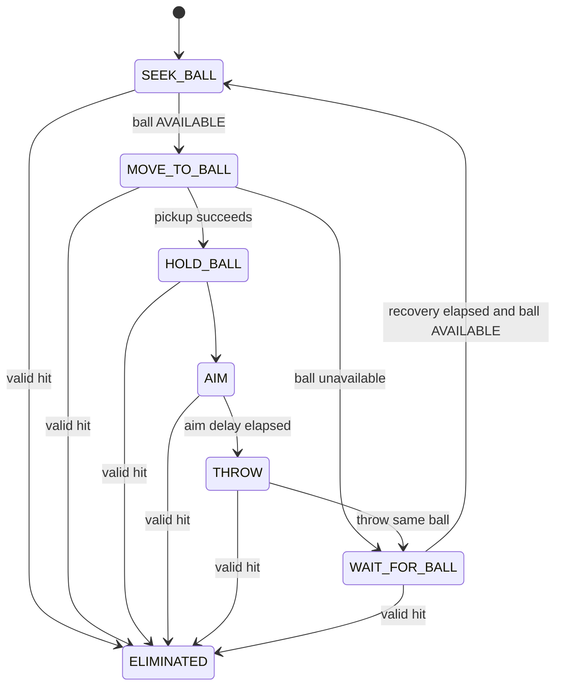
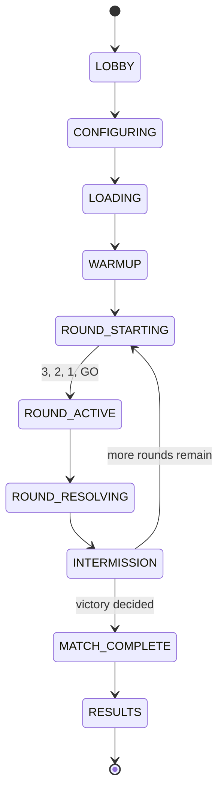
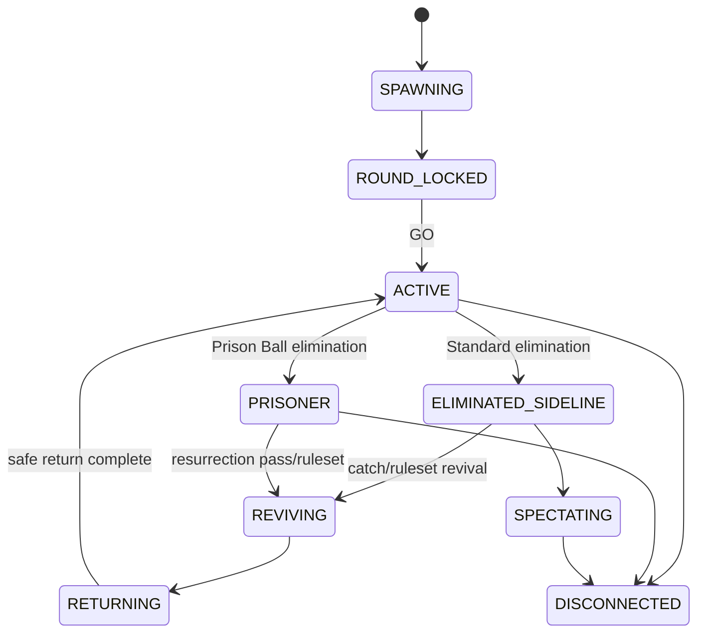
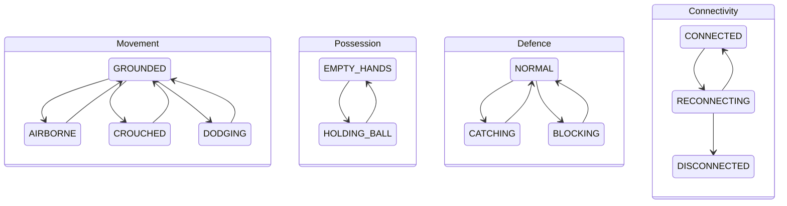
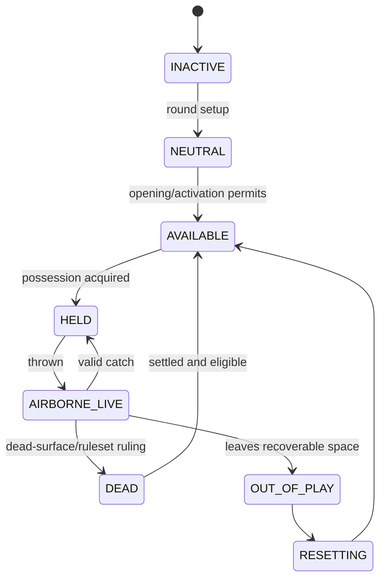
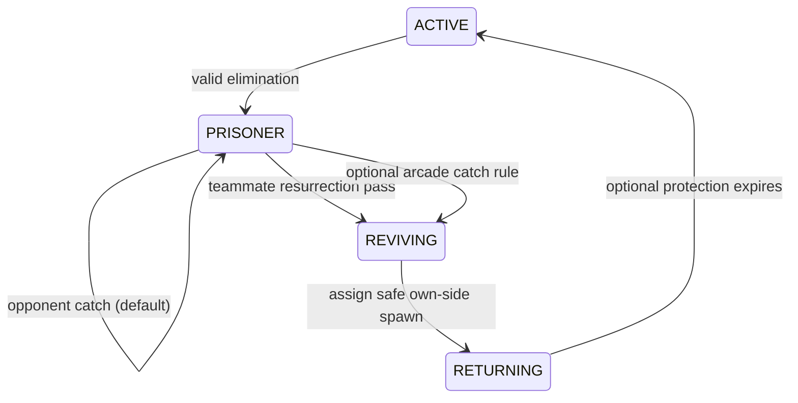

# State Machines

## Scope and notation

The first three diagrams describe implemented prototype code. Later diagrams
describe target states only and are not implemented. State authority and
transition details must remain explicit.

## Implemented prototype round state

`Main` owns this state and accepts gameplay and elimination only in `ACTIVE`.

## Implemented prototype ball state

Only `THROWN` is live. A direct valid hit or dead-surface contact ends live
flight. `CAUGHT` is an explicit transfer transition immediately followed by
`HELD`.

The current ball records thrower identity and a one-hit flag. It does not carry
multi-hit flight history.

## Implemented prototype bot state

## Future match lifecycle — Target architecture

Warmup is optional and configurable, with a suggested default of 10–15
seconds. Movement, throwing and catching are allowed, but persistent
eliminations are disabled so players can test latency, sensitivity and
trajectories.

Pause is a simulation policy/modifier, not a universal online match state.
Offline play may pause simulation; a personal menu does not pause an active
network match; server-admin pause may be allowed by server policy.

## Future player state groups — Target architecture

The primary match state is:

Orthogonal sub-states run alongside the match state:

Keeping movement, possession, defence and connectivity orthogonal avoids a
combinatorial state explosion such as
`ACTIVE_CROUCHED_HOLDING_BLOCKING_CONNECTED`. Each concern can enforce its own
legal transitions while the ruleset evaluates combinations explicitly.

## Future compact ball state — Target architecture

Deflection and blocking remain collision-history metadata within
`AIRBORNE_LIVE`, not top-level states. Flight metadata should include current
holder, last owner, original thrower, attacking team, activation status,
players already hit, blocking interactions, deflection history, catch
eligibility and a live-flight sequence identifier.

Team status is calculated from player states; it is not an independent mutable
state that can drift out of sync.

## Prison Ball elimination and revival — Target rules

